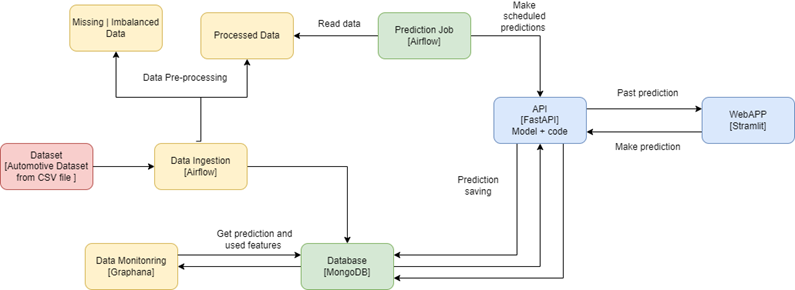

# DSP_Project
Car Price Prediction (Regression Problem)

## Group Name
AutoMotive

## Group Members
- GAWADE Amey
- KAREEM Leelav
- MAHENDRASINH PARMAR Nisarg
- MOBAYEN Amir
- MURALIKUMAR Vishal

## Dataset

[Car Price Prediction](https://cf-courses-data.s3.us.cloud-object-storage.appdomain.cloud/IBMDeveloperSkillsNetwork-DA0101EN-SkillsNetwork/labs/Data%20files/auto.csv)

## Description

The automotive dataset contains information on various car features such as make, body style, horsepower, and insurance risk rating. The dataset contains 26 such features, which include both categorical and numerical features. 

This data frame contains the following columns: 
- Risk Rating  
- Normalized Losses. 
- Make 
- Fuel-Type 
- Aspiration 
- Num-Of-Doors 
- Body-Style 
- Drive-Wheels 
- Engine-Location 
- Wheelbase 
- Length 
- Width 
- Height 
- Curb-Weight 
- Engine-Type 
- Num-Of-Cylinders 
- Engine-Size 
- Fuel-System 
- Bore 
- Stroke 
- Compression-Ratio 
- Horsepower 
- Peak-Rpm 
- City-Mpg 
- Highway-Mpg 
- Price 

## Objective 
###Data Preparation: 
Understand the dataset and, if necessary, clean it up. 
Create Regression models to forecast car price. 
To find the best performing model, fine-tune the hyperparameters and compare the evaluation metrics of various regression algorithms. 

## Architecture Diagram



## Implementation

Our project will involve implementing a web application using Python programming language. The user interface will be based on a web platform and will include two pages: one for making predictions and another to display past predictions. The user interface will be designed using Streamlit, which is a Python library for building web applications.

The backend of the web application will be provided by FastAPI, which is a modern web framework for building APIs with Python. FastAPI will connect the user interface to the prediction system, allowing the user to make predictions and receive the results in real-time. The prediction system will read its data from a MongoDB database, which will store the relevant information.

## Installation

Clone the project from GitHub: 
```
git clone https://github.com/ahmobayen/DSP_Project.git
```
Navigate to the project directory: `cd <repository>`
Create a virtual environment: `python3 -m venv env`
Activate the virtual environment: `source env/bin/activate`
or for conda do: `conda activate <env>`

Install the required packages: `pip install -r requirements.txt`
or for conda do : `conda install --file requirements.txt`

## Running the system:
in virtual environment type these commands to activate the system
Start the FastAPI server: `uvicorn main:app --reload`
Open a new terminal window and activate the virtual environment
Start the Streamlit web application: `streamlit run app.py`

## Usage
Use the web interface to upload a CSV file and make a prediction or fill the from
